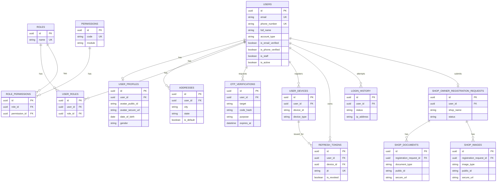

# Quicker-X — Database Schema (Phase 1)

## Conventions applied to every table

Every table below inherits these columns from `apps.core.models.BaseModel`:

| Column | Type | Notes |
|---|---|---|
| `id` | UUID (PK) | `default=uuid4`, generated app-side, not DB-side, so it's `INSERT`-safe with app-level dedupe checks. |
| `created_at` | timestamptz | `auto_now_add`, indexed |
| `updated_at` | timestamptz | `auto_now` |
| `created_by_id` | UUID (FK → users.id, SET NULL) | actor who created the row |
| `updated_by_id` | UUID (FK → users.id, SET NULL) | actor who last modified the row |
| `is_active` | boolean | indexed, default `True` |
| `is_deleted` | boolean | indexed, default `False` — soft delete flag |
| `deleted_at` | timestamptz, nullable | set when soft-deleted |

The default manager (`Model.objects`) automatically filters `is_deleted=False`.
`Model.all_objects` returns every row including soft-deleted ones (used by admin tooling and audit views).

## ER Diagram

## Table-by-table notes

### `users`
Single authentication table for every actor (Customer, Shop Owner, Admin, Super Admin — `account_type`).
- **`phone_number` is the JWT identifier (`USERNAME_FIELD`)** — every customer-facing mockup (Login, Register, Forgot Password, OTP) collects a mobile number, never an email. `email` is kept on the table but is optional and not collected by any Phase 1 screen.
- Unique indexes on `phone_number` and `email`.
- Composite index `(account_type, is_active)` — the query pattern the admin panel uses most ("all active shop owners", "all active customers").
- Password hashing is Django's default (PBKDF2); swap `PASSWORD_HASHERS` in settings if you need Argon2.

### `user_profiles`
1:1 with `users`. Kept separate from `users` so identity/credential concerns (auth table) don't mix with softer profile data (avatar, DOB, bio) that changes far more often — smaller write locks on the hot auth table.

### `roles`, `permissions`, `role_permissions`, `user_roles`
Classic RBAC join. A user can hold more than one role (e.g., promoted from Customer to also being a Shop Owner) via `user_roles`. `HasRole`/`IsAdminOrSuperAdmin` permission classes in `apps.core.permissions` read this table at request time.

### `otp_verifications`
Generic OTP table used for registration email verification, login 2FA (future), forgot-password, and phone verification — differentiated by `purpose`. Codes are stored as SHA-256 hashes (`code_hash`), never plaintext. `attempts`/`max_attempts` throttles brute force per OTP in addition to the DRF `ScopedRateThrottle` on the `otp` scope.

### `user_devices` / `refresh_tokens`
Together these give you real session management: every login binds a refresh token to a device row. Deactivating a user or resetting a password revokes every `refresh_tokens` row for that user, which effectively logs them out everywhere even though JWT access tokens are stateless. This works alongside SimpleJWT's own `token_blacklist` app (also installed) which handles the low-level rotate/blacklist mechanics.

### `login_history`
Append-only audit trail — the Django admin registration disables add/change so it can only ever be written by application code, never edited by hand.

### `shop_owner_registration_requests`
One row per application, 1:1 with the `users` row created for that shop owner at submission time. The account exists immediately (so `shop-owner/login/` can return a clean "pending" error), but `IsApprovedShopOwner` gates every shop-owner-only endpoint on `status == APPROVED`. `reviewed_by` / `reviewed_at` / `rejection_reason` give the admin panel a full audit trail per application.

> **Field-mapping caveat:** the specific business/owner/bank fields on this model are a best-practice superset inferred from a typical marketplace shop-registration form. Once you share the actual Flutter Shop Owner UI screen-by-screen, reconcile this model 1:1 (rename/add/remove fields) before running `makemigrations` for real — don't ship this field set to production unchecked.

### `shop_documents` / `shop_images`
Only Cloudinary metadata is persisted (`public_id`, `secure_url`, `resource_type`, `width`, `height`, `bytes`, `folder`, `version`, `format`) — binaries never touch Postgres. `apps.shop_owner.services.cloudinary_service` is the only code path allowed to call the Cloudinary SDK.

### `addresses`
Shared by customers (multiple delivery addresses, one `is_default`) and could be reused for shop addresses in a later phase if you want address history separate from the registration snapshot.

## Indexing strategy

- Every FK gets an implicit B-tree index from Postgres.
- Additional composite indexes were added only where the API's actual query patterns need them (see model `Meta.indexes` in each app) — e.g. `(user, is_active)` on `user_roles`, `(status)` on `shop_owner_registration_requests`, `(city, state)` on `addresses`.
- Avoid over-indexing at this stage: each extra index costs write throughput. Add more once Phase 2 introduces read-heavy search/browse endpoints (products, orders) and you can profile real query plans.

## Constraints

- `UniqueConstraint(user, role)` on `user_roles` — a user can't be assigned the same role twice.
- `UniqueConstraint(role, permission)` on `role_permissions`.
- `UniqueConstraint(user, device_id)` on `user_devices`.
- `unique=True` on `refresh_tokens.jti`, `users.email`, `users.phone_number`, `roles.name`, `permissions.code`.
- All destructive admin actions (`DELETE /admin/users/{id}/`) are soft deletes only — no hard `DELETE` is ever issued by the API.
